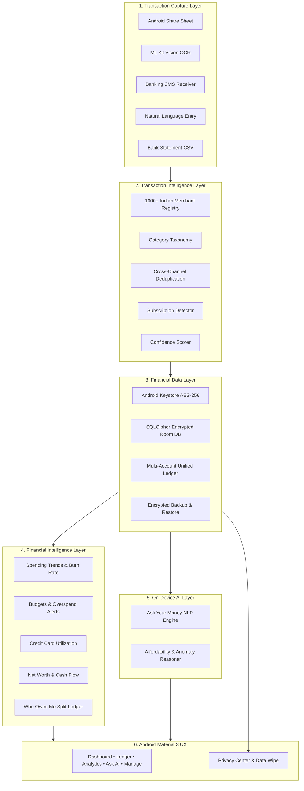

# IntelliExpense 🇮🇳 ⚡

**Production-Ready Android-First Personal Finance and Expense Tracking App for India**
Built around **zero-friction automatic expense capture** and **privacy-first, local-first architecture**.

[](https://android.com)
[](https://kotlinlang.org)
[](https://developer.android.com/jetpack/compose)
[](https://www.zetetic.net/sqlcipher/)
[]()
[-success.svg)]()

---

## 🌟 Key Highlights

- **Zero-Friction Transaction Capture**:
  - **Android Share Sheet Receiver**: Share payment receipts directly from **Google Pay, PhonePe, Paytm, CRED, Navi, BHIM**, or mobile banking apps. IntelliExpense pops up an instant preview card for 1-tap confirmation.
  - **Local OCR / Vision Extraction**: Scans screenshots of UPI payment receipts completely on-device using Google ML Kit Text Recognition.
  - **Strict Banking SMS Parser**: High-precision regex engine for Indian banks (HDFC, SBI, ICICI, Axis, Kotak, PNB, etc.). Automatically ignores OTPs, spam, and promotional alerts.
  - **Natural Language Manual Entry**: Supports plain English manual entries like *"Swiggy 450 yesterday via HDFC"*, *"Spent 1200 for groceries at Blinkit"*, or *"50 auto cash"*.
  - **Bank Statement CSV Import**: Native import engine for HDFC, SBI, ICICI, Axis, Kotak, and Paytm bank statement files with narration cleaning.

- **Transaction Intelligence**:
  - **1000+ Indian Merchant Registry**: Normalizes brands across Food (Swiggy, Zomato), Quick Commerce (Blinkit, Zepto, Instamart, BigBasket), Mobility (Uber, Ola, Rapido, IRCTC), OTT Subscriptions, Utilities, and UPI VPAs.
  - **Multi-Tier Category Taxonomy**: Curated categories with custom icons, color tokens, and keyword matching.
  - **Smart Deduplication & Self-Transfers**: Eliminates duplicate entries between SMS and Share Sheet within a 10-minute window; detects transfers between user's own bank accounts.
  - **Subscription Detection**: Detects periodic cadences (weekly, monthly, quarterly, annual) and price changes.
  - **Confidence Scoring**: Confidence rating for every parsed transaction with an unreviewed verification banner for uncertain entries.

- **Financial Data Layer**:
  - **100% Local Encrypted Database**: Hardware-backed 256-bit AES encryption via **Android Keystore** and **SQLCipher** for Room.
  - **Unified Multi-Account Ledger**: Manage Bank Accounts, UPI VPAs, Credit Cards (with statement cycles and credit limits), Digital Wallets, and Cash in Hand.
  - **Double-Entry & Reconciliation**: Complete search, multi-filter chips, and encrypted JSON export & restore.

- **Financial Intelligence & AI ("Ask Your Money")**:
  - **100% On-Device Financial Assistant**: Operates completely offline without cloud AI APIs. Answers natural language queries:
    - *"How much did I spend on food this month?"*
    - *"Why did my spending increase?"*
    - *"Show my biggest expenses"*
    - *"What subscriptions do I have?"*
    - *"Where can I reduce spending?"*
    - *"Can I afford this purchase?"*
    - *"Who owes me money?"*
  - **Spending Analytics & Cash Flow**: Daily burn rate, projected month-end spend, and net savings rate.
  - **Dynamic Budgets**: Threshold alerts at 80% and 100% of category limits.
  - **Credit Card Tracker**: Credit limit utilization health (<30% optimal) and due date countdown.
  - **Net Worth & Split Ledger**: Assets vs Liabilities net worth, plus "Who Owes Me" shared bill tracking.

- **Privacy & Security**:
  - No cloud account or login required.
  - No financial data ever leaves your device.
  - Optional SMS permission strictly isolated to transaction parsing.
  - Dedicated **Privacy Center** with data storage audit, permission controls, and 1-tap complete data wipe.

- **UX & Design**:
  - Curated Indian Fintech theme (Obsidian Dark `#0A0E17`, Emerald `#10B981`, Rupee Gold `#F59E0B`).
  - Indian numbering system typography (`₹1,50,000.00`, `₹1.5L`, `₹2.5Cr`).

---

## 🏛 Architecture



---

## 🧪 Verification & Tests

The project includes 33 unit tests covering all parsers, calculators, AI intents, and deduplication logic:

```bash
./gradlew testDebugUnitTest
```

```
BUILD SUCCESSFUL in 3s
33 tests completed, 0 failures, 100% success rate
```

---

## 🚀 Building & Installing

### Prerequisites
- JDK 17
- Android SDK (compileSdk 35, minSdk 26)

### Build Debug APK
```bash
./gradlew assembleDebug
```
Output APK is located at: `app/build/outputs/apk/debug/app-debug.apk`

### Install to Connected Device
```bash
adb install -r app/build/outputs/apk/debug/app-debug.apk
adb shell am start -n com.intelliexpense.app/.ui.MainActivity
```

---

## 🛡 License
Licensed under the Apache License, Version 2.0.
