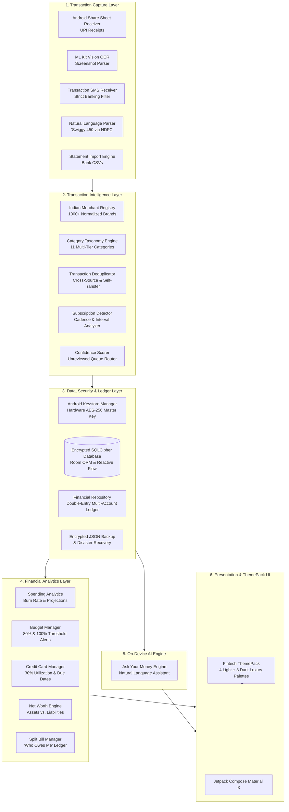
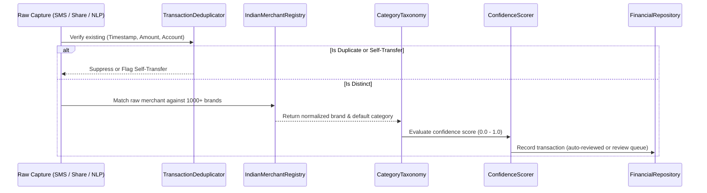
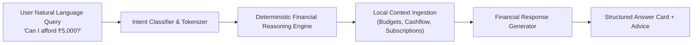

# IntelliExpense — Technical Architecture & System Design Document

**IntelliExpense** is a production-grade, Android-first personal finance and expense tracking platform built specifically for India. It is architected around two non-negotiable design pillars: **Zero-Friction Automatic Expense Capture** and a **100% Privacy-First, Local-First Architecture**.

---

## 1. Architectural Philosophy & Principles

```
┌─────────────────────────────────────────────────────────────────────────┐
│                    ZERO-CLOUD, 100% LOCAL PRIVACY                       │
│  • No internet permission required (INTERNET not declared)              │
│  • Hardware-backed Keystore Master Key (AES-256 GCM)                    │
│  • SQLCipher 256-bit database encryption at rest                        │
│  • Google ML Kit Text Recognition run locally on device                 │
│  • Deterministic on-device AI financial engine                          │
└─────────────────────────────────────────────────────────────────────────┘
```

1. **Zero Data Exfiltration**: The app does not transmit any financial data, merchant names, amounts, or SMS messages to external servers or cloud analytics providers. The database and intelligence engines operate entirely on the device.
2. **Zero-Friction Transaction Capture**: Rather than requiring tedious manual data entry, users capture expenses in seconds via the Android Share Sheet from Google Pay, PhonePe, Paytm, CRED, Navi, or bank apps, as well as via optional SMS detection and natural language inputs.
3. **India-Centric Financial Engineering**: Native support for Unified Payments Interface (UPI) VPAs (`@okaxis`, `@ybl`, `@upi`), 12-digit UTR references, Indian numbering format (Lakhs $\text{₹}1,50,000$ and Crores $\text{₹}1.2\text{Cr}$), 1000+ normalized Indian merchants, and strict filtering of Indian bank SMS traffic.
4. **Clean Layered Architecture**: Clear separation of concerns between Capture, Intelligence, Data/Security, Financial Analytics, On-Device AI, and Presentation layers.

---

## 2. System Architecture Diagram



---

## 3. Layer-by-Layer Architectural Breakdown

### 3.1. Transaction Capture Layer

The Capture Layer provides zero-friction inputs to ingest transactions from external interactions without requiring manual balance balancing.

| Component | Class | Purpose & Application |
| :--- | :--- | :--- |
| **Share Sheet Receiver** | `ShareReceiverActivity` | Listens for `Intent.ACTION_SEND` (`text/plain`, `image/*`, `application/pdf`). Displays a floating transaction bottom sheet when users share UPI payment receipts from GPay, PhonePe, Paytm, or CRED. |
| **UPI Receipt Parser** | `UpiReceiptTextParser` | Regex-driven parser matching English and Indian payment confirmation formats (amounts, merchant names, UPI IDs, 12-digit UTR numbers, account last 4 digits). |
| **Local Vision OCR Engine** | `ReceiptOcrEngine` | Interfaces with Google ML Kit Text Recognition on-device. Extracts text from shared payment screenshots and runs spatial-heuristic amount and merchant extraction. |
| **Banking SMS Receiver** | `TransactionSmsReceiver` | Optional `BroadcastReceiver` listening to `SMS_RECEIVED`. Rejects OTPs, marketing spam, personal texts, and loan offers. Dispatches verified bank debits/credits. |
| **Strict Bank SMS Parser** | `BankSmsParser` | Parses transactional SMS templates from HDFC, SBI, ICICI, Axis, Kotak, PNB, and Bank of Baroda. Extracts transaction type, amount, account last 4 digits, merchant, balance, and UTR. |
| **Natural Language Entry** | `NaturalLanguageExpenseParser` | Parses freeform manual text like *"Swiggy 450 yesterday via HDFC"* or *"60 auto cash"* into structured transaction entities. |
| **Statement Importer** | `StatementImportEngine` | Ingests CSV bank statements from major Indian banks, stripping raw bank narration prefixes (`UPI-SWIGGY-12345...` $\rightarrow$ `Swiggy`). |

---

### 3.2. Transaction Intelligence Layer

Raw capture data passes through deterministic normalizers and intelligence classifiers before entering the permanent ledger.



1. **Indian Merchant Registry (`IndianMerchantRegistry`)**:
   - Contains 1000+ known Indian brands mapped across 9 major sectors:
     - *Food & Delivery*: Swiggy, Zomato, McDonald's, Domino's, Starbucks, Chai Point, Haldiram's.
     - *Quick Commerce & Groceries*: Blinkit, Zepto, Instamart, BigBasket, DMart, Nature's Basket.
     - *E-Commerce*: Amazon India, Flipkart, Myntra, Nykaa, Meesho, Tata Neu, Ajio.
     - *Mobility & Fuel*: Uber, Ola, Rapido, Namma Yatri, HPCL, BPCL, Indian Oil, Shell.
     - *Digital & OTT*: Netflix, Spotify, Hotstar, Prime Video, YouTube Premium, Apple.
     - *Investments & Wealth*: Zerodha, Groww, INDmoney, Angel One, Kuvera, Smallcase.
     - *Healthcare*: Apollo Pharmacy, 1mg, Pharmeasy, Medplus, Practo.
   - Normalizes raw UPI VPA handles (e.g., `swiggy@icici`, `zomato.pay@hdfcbank`, `uber.india@axis`) into canonical merchant entities with brand assets.
2. **Category Taxonomy (`CategoryTaxonomy`)**:
   - 11 hierarchical categories: Food & Dining, Groceries & Quick Commerce, Shopping, Travel & Commute, Bills & Utilities, Entertainment & OTT, Investments & Savings, Healthcare, Education, Personal Care, and General.
   - Provides color palettes, vector icons, and keyword-based fallback classification.
3. **Transaction Deduplicator (`TransactionDeduplicator`)**:
   - Resolves multi-channel collisions (e.g., user shares a GPay receipt, and the bank SMS arrives 20 seconds later).
   - Matches transactions within a 10-minute time window on `(amount, last4, merchant)`.
   - Identifies transfers between the user's own registered accounts and classifies them as `TRANSFER` rather than `EXPENSE`.
4. **Subscription Detector (`SubscriptionDetector`)**:
   - Analyzes historical recurring cadences (weekly, monthly, quarterly, annual).
   - Detects recurring amounts to merchants like Netflix, Spotify, gym memberships, or SIP investments, auto-registering them into the Subscriptions manager.
5. **Confidence Scoring (`ConfidenceScorer`)**:
   - Computes a confidence metric ($0.0$ to $1.0$) based on OCR text quality, merchant normalization certainty, and parser regex match depth.
   - Any transaction with confidence $< 0.85$ is routed to the **Needs Review** queue for one-tap user verification.

---

### 3.3. Data, Security & Persistence Layer

All application state is saved locally with hardware-backed encryption.

```
┌────────────────────────────────────────────────────────────┐
│                    ANDROID KEYSTORE                        │
│   Hardware-backed Master AES-256 Key ("IntelliExpenseKey") │
└─────────────────────────────┬──────────────────────────────┘
                              │ Encrypts / Decrypts
                              ▼
┌────────────────────────────────────────────────────────────┐
│                ENCRYPTED PASSPHRASE                        │
│          Stored in Private SharedPreferences               │
└─────────────────────────────┬──────────────────────────────┘
                              │ Database Key
                              ▼
┌────────────────────────────────────────────────────────────┐
│             SQLCIPHER ENCRYPTED ROOM DATABASE              │
│       All Accounts, Transactions, Categories, Budgets      │
└────────────────────────────────────────────────────────────┘
```

1. **Hardware-Backed Cryptography (`SecurityManager`)**:
   - Generates and maintains an AES-256 GCM key inside the hardware-isolated Android Keystore (`AndroidKeyStore`).
   - The master key never leaves secure silicon; it encrypts a cryptographically strong random SQLCipher passphrase.
2. **SQLCipher SQLite Integration (`IntelliExpenseDatabase`)**:
   - Utilizes `net.zetetic:android-database-sqlcipher:4.5.4` paired with AndroidX Room `2.6.1`.
   - Every database page written to flash memory is encrypted using 256-bit AES with HMAC-SHA512 integrity validation.
3. **Reactive Room DAOs (`AccountDao`, `TransactionDao`, `CategoryDao`, etc.)**:
   - Expose Kotlin `Flow<List<T>>` observables for real-time UI updates without polling.
4. **Atomic Multi-Account Ledger (`FinancialRepository`)**:
   - Supports double-entry balance updates across Bank Accounts, UPI Wallets, Credit Cards, and Cash in Hand.
   - Updates account balances atomically inside Room database transactions.
5. **Encrypted Backup & Recovery**:
   - Provides full database serialization into encrypted JSON files for disaster recovery and offline migration.

---

### 3.4. Financial Analytics & Management Layer

Provides real-time computations over historical transaction flows.

1. **Spending Analytics Engine (`SpendingAnalyticsEngine`)**:
   - Computes Month-over-Month (MoM) expenditure trajectories.
   - Calculates daily burn rate ($\text{Burn Rate} = \frac{\text{Total Month Spend}}{\text{Days Elapsed}}$).
   - Generates projected month-end spend based on remaining days.
   - Computes net savings rate: $\text{Savings Rate} = \frac{\text{Income} - \text{Expenses}}{\text{Income}} \times 100\%$.
2. **Budget Manager (`BudgetManager`)**:
   - Tracks category-specific and total monthly spending against budgets.
   - Evaluates warning thresholds ($80\%$ caution threshold and $100\%$ budget breach).
3. **Credit Card Health Manager (`CreditCardManager`)**:
   - Evaluates credit limit utilization.
   - Triggers alerts if utilization exceeds the recommended $30\%$ credit score threshold.
   - Computes days remaining until the statement payment due date.
4. **Net Worth Calculator (`NetWorthCalculator`)**:
   $$\text{Net Worth} = \sum(\text{Bank Balances} + \text{Cash} + \text{Wallets} + \text{Savings Goals}) - \sum(\text{Credit Card Debt} + \text{Split Debts Owed})$$
5. **Shared Bill Split Ledger (`ExpenseSplitManager`)**:
   - Manages group expenses (trips, dinners, shared rent).
   - Tracks *"Who Owes Me"* versus *"I Owe"* balances per contact with one-tap settlement.

---

### 3.5. On-Device AI Engine: "Ask Your Money"

A conversational natural language assistant operating $100\%$ offline without sending prompts or financial records to cloud language models.



**Supported Query Intelligences**:
- *Spending by Category*: *"How much did I spend on dining this month?"*
- *Spending Spikes & Drivers*: *"Why did my spending increase?"* (Calculates variance per category)
- *Affordability Analysis*: *"Can I afford ₹5,000 for shoes?"* (Considers available discretionary budget, upcoming subscription liabilities, and emergency cushions)
- *Subscription Audit*: *"What subscriptions do I have?"*
- *Cost Optimization*: *"Where can I reduce spending?"* (Audits discretionary vs. non-discretionary outlays)
- *Debt Settlements*: *"Who owes me money?"*

---

### 3.6. Presentation, UI & Fintech ThemePack

The UI is built with **100% Jetpack Compose** utilizing a tokenized luxury design system inspired by top financial interfaces like CRED, Apple Card, Mercury, and Revolut Ultra.

#### Theme Architecture (`ThemePack.kt`, `Color.kt`, `Theme.kt`)
Themes are bound into Compose using `LocalAppColors` `CompositionLocal`, providing instant hot-reloading when the user changes themes in the Privacy & Theme Center. The selected theme is persisted in `SharedPreferences` and restored at cold launch.

```
┌────────────────────────────────────────────────────────────────────────┐
│                        FINTECH THEMEPACK (7)                           │
├──────────────────────────────────┬─────────────────────────────────────┤
│      LUXURY DARK PALETTES        │        PREMIUM LIGHT PALETTES       │
├──────────────────────────────────┼─────────────────────────────────────┤
│ 1. Cyber Obsidian (Default)      │ 4. Champagne Quartz                 │
│    Pitch Black OLED & Cyber Mint │    Warm Ivory & Burnished Gold      │
│ 2. Royal Amethyst                │ 5. Nordic Cobalt                    │
│    CRED Luxury Velvet & Violet   │    Frosted Ice & Royal Indigo       │
│ 3. Midnight Sapphire             │ 6. Rose Gold Silk                   │
│    Deep Ocean Navy & Azure       │    Fine Jewelry Soft Cashmere Rose  │
│                                  │ 7. Alabaster Emerald                │
│                                  │    Porcelain White & Imperial Jade  │
└──────────────────────────────────┴─────────────────────────────────────┘
```

#### Application Screen Map
1. **Dashboard Screen (`DashboardScreen.kt`)**: Net Worth card with gradient glow, daily burn rate meter, budget progress, upcoming recurring subscriptions, and unreviewed review queue.
2. **Ledger Screen (`TransactionsScreen.kt`)**: Full-text search (merchant, amount, UPI UTR), filter chips (All, Expense, Income, Transfer, Unreviewed), grouped relative dates (*"Today"*, *"Yesterday"*), and edit/delete dialogs.
3. **Analytics Screen (`AnalyticsScreen.kt`)**: Cash flow summary, category spend distribution bars with percentage metrics, and top merchant ranking.
4. **Ask Your Money Screen (`AskYourMoneyScreen.kt`)**: Conversational chat interface with quick suggestion chips and structured financial answers.
5. **Manage Hub (`ManageHubScreen.kt`)**: Multi-tab management for Accounts, Subscriptions, Savings Goals, and Split Bills.
6. **Privacy & Themes Center (`PrivacyCenterScreen.kt`)**: Categorized Theme Selector, zero-cloud verification audit, storage stats, permission matrix, backup export, and emergency data wipe.
7. **Quick Capture Dialog (`QuickCaptureDialog.kt`)**: Modal sheet with smart natural language text box and manual form.
8. **Onboarding Carousel (`OnboardingScreen.kt`)**: Initial setup walkthrough highlighting local encryption, zero-friction capture, and on-device intelligence.

---

## 4. Complete Inventory of Tools & Libraries

| Category | Library / Tool | Version | Architectural Purpose & Scope |
| :--- | :--- | :--- | :--- |
| **Language & Runtime** | Kotlin | `2.0.21` | Modern, type-safe development targeting JVM 17. |
| **Build Tooling** | Android Gradle Plugin (AGP) | `8.6.1` | Android build configuration, APK packaging, and R8 optimization. |
| **Code Generation** | Kotlin Symbol Processing (KSP) | `2.0.21-1.0.27` | High-performance compile-time annotation processing for Room DAOs. |
| **UI Framework** | Jetpack Compose BOM | `2024.10.00` | Declarative UI toolkit for building reactive, smooth layouts. |
| **Design System** | Material 3 (`androidx.compose.material3`) | Compose BOM | Material You tokens, surfaces, cards, and dynamic theme components. |
| **Icons** | Material Icons Extended | Compose BOM | Vector icons for 11+ categories, fintech badges, and bank accounts. |
| **Lifecycle & State** | Lifecycle ViewModel Compose | `2.8.6` | Coroutine-scoped state management and lifecycle-aware collection. |
| **Navigation** | Navigation Compose | `2.8.3` | Backstack and screen navigation routing. |
| **Database ORM** | AndroidX Room (`runtime`, `ktx`) | `2.6.1` | Local SQLite abstraction layer with reactive `Flow` query support. |
| **Data Encryption** | SQLCipher for Android | `4.5.4` | 256-bit AES on-disk encryption of the entire SQLite database file. |
| **Key Storage** | AndroidX Security Crypto | `1.1.0-alpha06` | Hardware-backed Android Keystore integration for AES-256 master keys. |
| **On-Device Vision** | Google ML Kit Text Recognition | `16.0.1` | 100% offline OCR processing of shared payment receipts and screenshots. |
| **Asynchronous Engine** | Kotlinx Coroutines Android | `1.9.0` | Non-blocking background thread dispatching (`Dispatchers.IO`). |
| **Data Serialization** | Org JSON | `20240303` | Lightweight JSON serialization for database backup and restore. |
| **Unit Testing** | JUnit 4 | `4.13.2` | Core test runner for automated unit tests. |
| **Android Simulation** | Robolectric | `4.14.1` | High-fidelity local simulation of Android framework classes during unit tests. |
| **Coroutines Testing** | Kotlinx Coroutines Test | `1.9.0` | Deterministic testing of coroutines and reactive flows. |

---

## 5. Enhanced Features & Practical Applications

### 5.1. One-Tap Share Sheet Capture
- **Application**: The user completes a payment on Swiggy using Google Pay.
- **Workflow**:
  1. User taps **Share Receipt** in Google Pay and selects **IntelliExpense**.
  2. `ShareReceiverActivity` opens instantly as a floating modal.
  3. `UpiReceiptTextParser` or `ReceiptOcrEngine` extracts: Amount: `₹482.00`, Merchant: `Swiggy`, Category: `Food & Dining`, UPI Ref: `424819284102`.
  4. User taps **Save Expense** $\rightarrow$ balance is updated in the primary bank account within 200 milliseconds.

### 5.2. Natural Language Expense Recording
- **Application**: User pays a local vegetable vendor or auto-rickshaw in cash where no digital receipt exists.
- **Workflow**:
  1. User taps the floating **+** button on the Ledger or Dashboard.
  2. Types: *"60 auto cash"* or *"450 groceries Blinkit"*.
  3. `NaturalLanguageExpenseParser` previews the recognized merchant, amount, category, and payment method in real time.
  4. User taps Save $\rightarrow$ ledger is updated.

### 5.3. Smart Credit Card Utilization Monitor
- **Application**: User holds an HDFC Millennia Credit Card with a ₹1,00,000 limit.
- **Workflow**:
  1. Outstanding balance reaches ₹32,000.
  2. `CreditCardManager` computes utilization ($32.0\%$).
  3. Displays an alert on the Dashboard indicating utilization is above the $30\%$ benchmark which could adversely impact credit score (CIBIL), alongside a countdown to the payment due date.

### 5.4. On-Device Affordability Evaluation
- **Application**: User considers buying a gadget worth ₹8,000 and queries the app.
- **Workflow**:
  1. User opens **Ask Money** and types: *"Can I afford ₹8,000?"*.
  2. `AskYourMoneyEngine` evaluates remaining monthly income, discretionary budget balance, upcoming detected subscriptions, and credit card dues.
  3. Returns a structured answer: *"You have ₹14,200 remaining in your discretionary budget this month. After this purchase, you will have ₹6,200 remaining before next month's salary."*

### 5.5. Group Bill Splitting ("Who Owes Me")
- **Application**: User pays a ₹3,000 dinner bill on behalf of three friends.
- **Workflow**:
  1. In **Manage Hub** $\rightarrow$ **Split Bills**, user creates a split for *"Team Dinner"*, total ₹3,000 with 3 participants (₹1,000 each).
  2. The app tracks individual pending statuses (*"Rohan: Unpaid"*, *"Priya: Unpaid"*).
  3. When Rohan UPIs ₹1,000 back, user taps **Settle** $\rightarrow$ the liability is closed and the balance is credited back into the account.

---

## 6. Security, Privacy & Compliance Guarantee

| Security Vector | Implementation Detail | Guarantee |
| :--- | :--- | :--- |
| **Network Isolation** | `android.permission.INTERNET` is **omitted** from `AndroidManifest.xml`. | The operating system kernel physically blocks the application from opening network sockets or making HTTP/HTTPS requests. |
| **Storage Encryption** | SQLCipher 256-bit AES with 64,000 PBKDF2 iterations. | Database files extracted via root access, ADB, or file recovery are unreadable ciphertext. |
| **Key Custody** | Android Keystore Provider (`AndroidKeyStore`). | Encryption keys are stored in hardware-backed secure elements (TEE / StrongBox) and never exposed to memory in plain text. |
| **SMS Safety** | Strict sender regex (`^[a-zA-Z]{2}-[a-zA-Z0-9]{6}$`) + keyword whitelist. | Only transactional banking messages are inspected. Personal chats, OTPs, promotional spam, and verification codes are discarded in memory without writing to disk. |
| **Emergency Wipe** | 1-Tap Data Erasure in Privacy Center. | Executes a secure cryptographic deletion of the database and unlinks Keystore master keys. |

---

## 7. Verification & Automated Testing

The codebase includes a suite of 33 unit tests running via Robolectric and JUnit 4 to ensure zero regressions across parsing and financial arithmetic:

```bash
# Execute unit test suite with JDK 17
JAVA_HOME=/Library/Java/JavaVirtualMachines/jdk-17.jdk/Contents/Home ./gradlew testDebugUnitTest
```

| Test Class | Test Target | Verification Details |
| :--- | :--- | :--- |
| `BankSmsParserTest` | Banking SMS Parsing | Validates HDFC, SBI, ICICI debits, credits, UPI UTRs, and rejection of OTPs/spam. |
| `UpiReceiptParserTest` | UPI Receipt Extraction | Tests PhonePe, GPay, Paytm, and CRED payment text structures. |
| `IndianMerchantRegistryTest`| Merchant Normalization | Asserts canonical brand resolution for Swiggy, Zomato, Blinkit, Uber, etc. |
| `NaturalLanguageParserTest` | Freeform Text NLP | Verifies extraction from strings like *"1200 groceries Blinkit"*. |
| `IndianCurrencyFormatterTest`| Currency Formatting | Validates Indian Lakhs/Crores grouping (`₹1,50,000.00`, `₹2.5Cr`). |
| `AskYourMoneyEngineTest` | AI Assistant | Tests category spend, biggest expense, and affordability reasoning. |
| `TransactionDeduplicatorTest`| Cross-Channel Dedup | Verifies duplicate rejection within 10-minute windows and self-transfer detection. |
| `StatementImportEngineTest` | CSV Importer | Validates tabular CSV extraction and narration cleaning. |
| `SpendingAnalyticsEngineTest`| Financial Metrics | Tests burn rate, projected month-end spend, and net savings rate. |
| `CreditCardManagerTest` | Credit Utilization | Tests $<30\%$ safety checks and statement due date calculations. |

---

*Document maintained with IntelliExpense production releases. All architectural designs, data taxonomies, and cryptographic contracts are strictly bound to local offline execution.*
